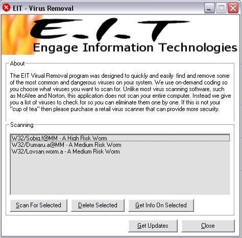



## EIT \- Virus Removal

### Description

This is a simple application that is meant to scan for a few of the most harmful and annoying worms and viruses. The code is very beginner, because I don't really know how to code (good) yet. Just try it and if you don't like it then don't vote. But don't flame my code because atleast I try.
 
### More Info
 
Could do system damage. Don't really know.

             |
---                |---
**Submitted On**   |2003-09-02 07:33:08
**By**             |[Conard Data Systems](https://github.com/Planet-Source-Code/PSCIndex/blob/master/ByAuthor/conard-data-systems.md)
**Level**          |Beginner
**User Rating**    |5.0 (10 globes from 2 users)
**Compatibility**  |VB 5\.0, VB 6\.0
**Category**       |[Complete Applications](https://github.com/Planet-Source-Code/PSCIndex/blob/master/ByCategory/complete-applications__1-27.md)
**World**          |[Visual Basic](https://github.com/Planet-Source-Code/PSCIndex/blob/master/ByWorld/visual-basic.md)
**Archive File**   |[EIT\_\-\_Viru163954922003\.zip](https://github.com/Planet-Source-Code/conard-data-systems-eit-virus-removal__1-48170/archive/master.zip)

